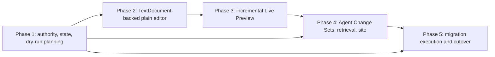

# Unified Agent Knowledge Documentation Implementation Plan

> **For agentic workers:** REQUIRED SUB-SKILL: Use superpowers:subagent-driven-development (recommended) or superpowers:executing-plans to implement this plan task-by-task. Steps use checkbox (`- [ ]`) syntax for tracking.

**Goal:** Replace the separate Draft and Knowledge product surfaces with one human- and Agent-editable `documentation/` QMD corpus, while preserving Code-OSS text authority, reviewable Agent proposals, local/SSH parity, and explicit recoverable migration.

**Architecture:** A new first-party `chatero-documentation` workspace extension owns Documentation presentation and one capability-scoped transaction facade. Ordinary typing and Live Preview edits converge on the Code-OSS `TextDocument`; resource/state/review/migration operations use bounded typed requests to a fixed authority-local helper that runs beside the local or SSH workspace authority. A mixed settlement has one journaled prepare and one digest-bound acknowledgement around its single owner-authorized `TextDocument` edit, never renderer-driven per-file writes. The native Codex host denies generic access to reserved roots and exposes only typed retrieval and staging tools.

**Tech Stack:** Code-OSS 1.132.0 extension APIs, Electron 42.7.1, Node 24.18.0, CommonJS activation plus testable ESM modules, CodeMirror 6, Lezer Markdown, KaTeX, Quarto `--no-execute`, Node test runner, Code-OSS Mocha integration tests, Playwright/Electron smoke tests.

## Global Constraints

- The approved contract is [the unified Documentation design](../specs/2026-08-12-unified-agent-knowledge-documentation-design.md). A phase may narrow its exposed surface while incomplete, but it must not weaken that contract.
- Work on exactly one phase at a time. Finish its automated gates, review checkpoint, and rollback note before beginning the next phase.
- Code-OSS owns visible editors and the `TextDocument`; the workspace file service owns repository bytes; headless Zotero Core remains the only Zotero truth owner.
- Never open `zotero.sqlite` from an extension or renderer. Never use a personal profile, personal QLab workspace, or personal research output as a fixture.
- Do not copy Obsidian core code. Match its public Live Preview interaction model with public CodeMirror and Code-OSS APIs.
- Keep the standard Text Editor available for `.qmd` at every phase. The custom editor contribution remains `priority: "option"`.
- Human source edits use `WorkspaceEdit` against the open `TextDocument`. Agent changes are immutable private Change Sets until a human settles them.
- Every Change Set generation ID is exactly 16 lowercase hexadecimal characters (`^[0-9a-f]{16}$`); shorter, uppercase, prefixed, signed, and overflowing encodings are invalid.
- Generic Agent shell/file tools must fail closed for `documentation/**`, `.chatero/**`, `work/qlab-zotero/documentation-changes/**`, and `work/qlab-zotero/documentation-migration/**`, even in Full Access. Typed retrieval and proposal tools are the only Agent access path.
- No-execute is invariant for Live Preview, sandboxed passive-subset Quarto preview, retrieval, review, migration reporting, and Main Site publication. `--no-execute` is necessary but never the process-security boundary: Quarto receives only product-generated derived snapshots/configuration inside a deny-by-default child-process sandbox, and unavailable confinement fails closed.
- A Documentation failure must not prevent standard Code-OSS editing or Zotero Core startup.
- Every mutation is idempotent, revision-bound, capability-scoped, and recoverable without overwriting an unrecognized third-party revision.
- Local and SSH adapters run the same contract suite. Remote resource transactions are complete authority-side transactions, not a series of renderer-driven file writes.
- `chatero-documentation` extension and webview modules never import Node filesystem APIs for workspace bytes. The only Documentation filesystem implementation is the fixed Chatero Documentation authority helper; its executable path and protocol are product-owned constants, and callers cannot select a program, root, command, or raw file operation.
- Immediately before every Documentation authority-helper spawn, the product-owned composition root revalidates the canonical Code-OSS or Remote Agent install tree and exact helper/extension digest. Replacement after activation or connection therefore fails before spawn; a prior integrity result is not reusable execution authority.
- A cached Remote Agent is reusable only after its complete installed tree matches a tree manifest whose digest is covered by the signed release manifest. Owner/mode checks plus `.chatero-release-sha256` are not sufficient; any executable, helper, extension, SDK, notice, extra path, mode, or symlink-target change forces a verified reinstall or fails closed.
- Production packaging always requires a signed, complete Remote Agent release containing both pinned Linux tuples and the exact Documentation extension/helper tree. It has no unsigned or environment-selected fallback, and its installed local/SSH smoke runs with release-selection environment variables unset.
- Generated Code-OSS checkout and application bundles remain ignored. Every generated first-party asset is rebuilt deterministically and verified against provenance.

---

## Locked Inputs

| Input | Pin or decision |
| --- | --- |
| Code-OSS | `1.132.0` at `df53daabb18cd157bdb08c7f01c34df936cf12f4` |
| Codex app-server protocol | `@openai/codex` `0.142.0`, already generated in the pinned Code-OSS source |
| Node / Electron | `24.18.0` / `42.7.1` from `products/workbench/upstreams.json` |
| Canonical authored root | `documentation/**/*.qmd` |
| Workflow state | `.chatero/documentation-state.v1.json`, path-scoped `working | reviewed` |
| Agent proposals | `work/qlab-zotero/documentation-changes/<lineage>/<generation>/` |
| Migration evidence | `work/qlab-zotero/documentation-migration/` |
| Live Preview editor id | `chatero.documentation.livePreview` |
| Feature gate | `chatero.documentation.enabled`; off through Phases 1–4, on by default only at Phase 5 cutover |

The generated schema from the pinned Codex `0.142.0` binary contains
`permissions` on all four lifecycle inputs: `ThreadStartParams`,
`TurnStartParams`, `ThreadForkParams`, and `ThreadResumeParams`. Phase 4 must
assert those fields from the bundled binary rather than relying on a hand-kept
SDK declaration. Native permission profiles do not compose with legacy sandbox
configuration, so selecting a profile in an RPC is not by itself a security
boundary. Before the first turn, every local and SSH launch must inspect
`config/read({includeLayers:true,cwd})`, `configRequirements/read`, and
`permissionProfile/list`; a legacy sandbox setting, a modified/missing Chatero
profile, an unexpected effective/default profile, or a managed-policy denial of
a required profile fails closed before Agent code runs. Chatero's fixed
read-only, workspace, and Full Access profiles all deny
generic reads and writes to the Documentation reserved roots, every selected
workspace's `.codex/**`, and the actual process `CODEX_HOME`. The Full Access
profile's broad `:root` write is overridden by more-specific canonical denies
for the Code-OSS or Remote Agent installation tree, the Documentation authority
helper/extension tree, and the bundled Codex tree, and that profile may not
extend `:danger-full-access`. The tests cover start, turn, fork, resume, local,
and SSH. Prompts and `AGENTS.md` are guidance only and are never treated as
access control.

## Target File Structure

```text
products/workbench/
├── documentation-authority/
│   ├── protocol.mjs
│   └── runtime/
│       └── chatero-documentation-authority.mjs
├── extensions/
│   ├── chatero-documentation/
│   │   ├── package.json
│   │   ├── extension.cjs
│   │   ├── documentation-capabilities.mjs
│   │   ├── documentation-authority-client.mjs
│   │   ├── documentation-path.mjs
│   │   ├── documentation-state.mjs
│   │   ├── documentation-operations.mjs
│   │   ├── documentation-transactions.mjs
│   │   ├── documentation-workspace.mjs
│   │   ├── working-copy-coordinator.mjs
│   │   ├── text-change-set.mjs
│   │   ├── pending-edit-rebase.mjs
│   │   ├── documentation-tree.cjs
│   │   ├── migration-model.mjs
│   │   ├── migration-planner.mjs
│   │   ├── migration-rewrite.mjs
│   │   ├── live-preview-provider.cjs
│   │   ├── live-preview-protocol.mjs
│   │   ├── live-preview-bridge.mjs
│   │   ├── documentation-image-resolver.mjs
│   │   ├── quarto-preview-manager.mjs
│   │   ├── change-set-model.mjs
│   │   ├── change-set-store.mjs
│   │   ├── stable-hunks.mjs
│   │   ├── three-way-reconcile.mjs
│   │   ├── documentation-review.cjs
│   │   ├── documentation-agent-tools.mjs
│   │   ├── documentation-retrieval.mjs
│   │   ├── documentation-site.mjs
│   │   ├── migration-proposal-import.mjs
│   │   ├── migration-executor.mjs
│   │   ├── migration-recovery.mjs
│   │   ├── media/documentation.svg
│   │   └── webview/
│   │       ├── live-preview-entry.mjs
│   │       ├── live-preview-editor.mjs
│   │       ├── qmd-language.mjs
│   │       ├── qmd-source-model.mjs
│   │       ├── qmd-preview.mjs
│   │       └── live-preview.css
├── patches/code-oss/
│   └── 0004-chatero-documentation-agent-authority.patch
├── remote-agent/
│   └── runtime/
│       └── chatero-install-integrity.mjs
├── scripts/
│   └── build-documentation-extension.mjs
└── tests/
    ├── documentation-authority.test.mjs
    ├── documentation-state.test.mjs
    ├── documentation-migration-plan.test.mjs
    ├── documentation-text-bridge.test.mjs
    ├── documentation-live-preview.test.mjs
    ├── documentation-qmd-render.test.mjs
    ├── documentation-change-set.test.mjs
    ├── documentation-review.test.mjs
    ├── documentation-agent-authority.test.mjs
    ├── documentation-retrieval.test.mjs
    ├── documentation-site.test.mjs
    ├── documentation-migration-execution.test.mjs
    └── documentation-migration-recovery.test.mjs
```

Files are introduced only in the phase that makes them useful. The names above
are the stable seams shared by the five plans; phase plans list every actual
create/modify operation.

## Dependency Map



The arrows are hard gates, not scheduling hints. Although some code could be
written in parallel, the approved contract permits only one active phase so
that authority failures are discovered before more surfaces depend on them.

## Phase Plans

- [ ] Execute [Phase 1 — Documentation Authority and Migration Planning](./2026-08-12-documentation-phase-1-authority.md).
- [ ] Execute [Phase 2 — TextDocument-backed Editor](./2026-08-12-documentation-phase-2-textdocument-editor.md).
- [ ] Execute [Phase 3 — Incremental Live Preview](./2026-08-12-documentation-phase-3-live-preview.md).
- [ ] Execute [Phase 4 — Agent Review, Retrieval, and Main Site](./2026-08-12-documentation-phase-4-agent-review.md).
- [ ] Execute [Phase 5 — Explicit Migration and Cutover](./2026-08-12-documentation-phase-5-migration-cutover.md).

## Cross-Phase Public Contracts

The implementation is JavaScript, so these TypeScript shapes are normative
JSDoc contracts and test vocabulary, not a request to introduce a second build
system:

```ts
type DocumentationStateName = "working" | "reviewed";
type DocumentationPath = string & { readonly __documentationPath: unique symbol };
type ChangeSetGenerationId = string & { readonly __changeSetGenerationId: unique symbol }; // /^[0-9a-f]{16}$/
type ChangeSetRef = Readonly<{ lineageId: string; generationId: ChangeSetGenerationId }>;
type MigrationPathProof = Readonly<{
  path: string; // normalized workspace-relative path
  role: "source" | "target";
  expectedDigest?: string;
  intendedDigest?: string;
  targetAbsent?: true;
  directoryGeneration?: string;
  requireClean: boolean;
}>;
type MigrationPlanV1 = Readonly<{
  schemaVersion: 1;
  digest: string;
  workspaceEpoch: string;
  affectedPaths: readonly string[];
  pathProofs: readonly MigrationPathProof[];
  intendedOutputManifest?: never;
}>;
type MigrationIntendedOutput = Readonly<{
  path: string; // normalized workspace-relative output path
  kind:
    | "canonical-page"
    | "canonical-asset"
    | "workflow-state"
    | "change-set-manifest"
    | "change-set-blob"
    | "quarantine-evidence";
  size: number;
  sha256: string;
}>;
type MigrationPlanV2 = Readonly<{
  schemaVersion: 2;
  digest: string;
  workspaceEpoch: string;
  affectedPaths: readonly string[];
  pathProofs: readonly MigrationPathProof[];
  intendedOutputManifest: readonly MigrationIntendedOutput[];
}>;

type DocumentationResult =
  | { kind: "committed"; receipt: string }
  | { kind: "stale-document" | "stale-state" | "stale-review" | "stale-plan" }
  | { kind: "dirty-working-copy"; paths: readonly DocumentationPath[] }
  | { kind: "conflict" | "recovery-conflict"; evidenceRef: string }
  | { kind: "recovering"; operationId: string }
  | { kind: "idempotency-conflict"; idempotencyKey: string };

interface WorkspaceTransactionAdapter {
  snapshot(request: SnapshotRequest): Promise<SnapshotResult>;
  transact(request: TransactionRequest): Promise<TransactionResult>;
  recover(request: RecoveryRequest): Promise<RecoveryResult>;
}

type DocumentationWorkingCopyBarrierResource = Readonly<{
  uri: Uri;
  expectedVersion?: number;
  expectedDigest?: string;
  expectedDirectoryGeneration?: string;
  intendedDigest?: string;
  requireClean: boolean;
  targetAbsent?: true;
}>;

type DocumentationResourceOutcome = Readonly<
  | { kind: "create"; uri: Uri; intendedDigest: string }
  | { kind: "rename"; from: Uri; to: Uri; intendedDigest: string }
  | { kind: "delete"; uri: Uri; expectedDigest: string }
>;

interface DocumentationWorkingCopyBarrierLease {
  readonly operationId: string;
  revalidate(): Promise<
    | Readonly<{ kind: "valid" }>
    | DirtyWorkingCopy
    | BarrierConflict
  >;
  applyWorkspaceEdit(edit: WorkspaceEdit): Promise<boolean>;
  finalizeResourceOutcomes(outcomes: readonly DocumentationResourceOutcome[]): Promise<
    Readonly<{ kind: "finalized" }> | DirtyWorkingCopy | BarrierConflict
  >;
  dispose(): void;
}

declare function acquireDocumentationWorkingCopyBarrier(input: Readonly<{
  operationId: string;
  resources: readonly DocumentationWorkingCopyBarrierResource[];
  reason: "settlement" | "migration" | "recovery";
}>): Promise<
  | DocumentationWorkingCopyBarrierLease
  | DirtyWorkingCopy
  | BarrierConflict
>;
```

`MigrationPlanV1.affectedPaths` is the normalized, sorted, duplicate-free
projection of the complete `pathProofs` set; it is never derived from currently
open editors. Each content-free proof records the path's source/target role and
only its applicable expected/intended digest, target-absence, directory
generation, and clean-working-copy requirement. Canonical serialization of both
arrays is covered by `plan.digest`. At execution, Phase 5 combines those fixed
proofs with the current matching `TextDocument.version` and dirty state to
construct `DocumentationWorkingCopyBarrierResource` values; planning never
persists or returns stale editor versions as migration authority.

Phase 1 produces content-free `MigrationPlanV1` only. It does not yet have the
Phase 4 immutable Change Set builder, so V1 deliberately has no
`intendedOutputManifest` and is never executable. In Phase 5 Task 1, the
authority-side planner reruns its private snapshot/rewriter/import pipeline and
returns a fresh `MigrationPlanV2` content-free report plus a newly generated V2
token; it does not upgrade a V1 record in the extension. The user must review
that new V2 report before the UI may issue a new short-lived approval bound to
the V2 token and digest. A V1 token, report review, or approval is never
upgraded, rebound, or reused and returns `stale-plan`. V2 adds the complete,
normalized, sorted output manifest with exact relative path, closed output kind,
byte size, and SHA-256 for every canonical/state/Change Set/quarantine output,
all bound by `plan.digest`. Immediately before any V2 write, the helper
independently snapshots and deterministically recomputes all intended bytes,
then requires their exact paths, kinds, sizes, and hashes to match the V2
manifest; a mismatch produces zero canonical writes. Raw legacy and intended
output bodies remain helper-private and never cross into the extension or local
renderer.

For a mixed settlement the exact continuation is
`transact({kind:"prepare-settlement", ...}) ->
{kind:"awaiting-text",operationId,operationDigest,textOverlay}`; after a fresh
barrier `revalidate()`, only the returned lease applies that exact overlay.
Observed version/digest proof is then sent as
`transact({kind:"ack-settlement-text",operationId,operationDigest,textProof})`.
The helper verifies its durable journal before it commits metadata, exposes a
deferred child, or emits the terminal receipt. Approval is consumed only by
prepare; acknowledgement is an exact journal-bound continuation and cannot be
retargeted. Restart uses
`recover({kind:"inspect-settlement",operationId})`, never a generic read or
write request.

The adapter is a strict client for the fixed authority-local helper and never
exposes generic `read`, `write`, `exists`, a spawn primitive, or a caller-chosen
root. The same helper protocol executes in the local workspace extension host
and in the signed SSH Remote Agent workspace extension host; renderer-side code
never decomposes a transaction into per-file remote calls. The transaction
facade receives opaque scope/grant/approval objects whose records live in
module-private `WeakMap`s. JSON lookalikes, expired objects, wrong-workspace
objects, and reused one-use objects fail before filesystem access.

Phase 4 adds the product-private
`vscode.workspace.acquireDocumentationWorkingCopyBarrier(...)` API for the
built-in Documentation extension only. Acquisition names the complete set of
affected paths, including paths not currently open, and installs the barrier
before clean/revision checks. Until its lease is disposed, Code-OSS blocks
ordinary editor typing, manual save, autosave, non-owner bulk edits, file
create/move/copy/delete, and newly opened matching editors; only the lease's
one-shot `applyWorkspaceEdit(edit)` may perform the bound owner text edit. It
accepts only edits over the pre-bound resources/current expected versions whose
resulting per-URI digests equal every declared `intendedDigest`; a mismatch is
`BarrierConflict` with zero partial edits. `revalidate()` checks every expected
version/digest/directory generation, `requireClean`, and `targetAbsent`
immediately before the first authority mutation.

Before the first canonical mutation or owner text edit, the helper writes and
fsyncs private evidence plus an immutable prepared journal in `private-staged`
with `markerCommitted:false` and `canonicalMutationStarted:false`. It then
hashes the immutable prepared portion, exclusively creates and fsyncs
`.chatero/documentation-operation-active.v1.json` bound to that prepared-journal
digest, appends/fsyncs `marker-committed` without changing the bound prepared
bytes, and durably sets `canonicalMutationStarted:true` before applying the
first canonical change. The content-free marker contains only its
schema/version, operation ID/digest, workspace epoch, prepared-journal digest,
and sorted normalized affected relative paths with expected/intended
digests—never source text, an absolute path, capability, approval, or executable
path.

Code-OSS checks that fixed marker during early startup and SSH reconnect,
before restoring affected editable working copies, and blocks matching typing,
saves, bulk/resource operations, state changes, settlement, migration, and new
editable opens until mandatory authority-side recovery inspection succeeds. A
marker that references a missing/mismatched journal is quarantined behind a
broad Documentation read-only gate. With no marker, that broad gate applies
only when a valid operation record has already durably declared
`marker-committed`, `canonicalMutationStarted:true`, or a later phase. A
marker-free `private-staged` journal with both flags false proves no canonical
change was authorized: after exact before-proof validation the helper may retry
the private staging operation or abandon its evidence without broadly gating
Documentation. A present/post-marker gate may never be dismissed merely because
the Documentation extension failed to activate or a lease was disposed.

## State and Operation Invariants

- SHA-256 of exact UTF-8 bytes is the content revision. Open documents also bind `TextDocument.version` and dirty state.
- State generation and Change Set generation IDs are separate fixed-width 16-character lowercase hexadecimal counters. The whole state snapshot or Change Set generation is rejected if any field, path, or entry is invalid.
- Missing or rejected state means every observed page is `working` and emits one diagnostic; it never partially trusts valid-looking entries from a corrupt file.
- Operation records use `private-staged -> marker-committed -> applying -> text-applied/resources-applied -> metadata-applied -> committed`. `private-staged` is marker-free, has zero canonical changes, and may only retry exactly or become `abandoned`; `marker-committed` and later phases require the matching active marker. A terminal receipt is immutable. A mixed settlement uses exactly three typed stages: `prepare-settlement` consumes approval, durably stages private intent, crosses the marker-commit boundary, and applies resource operations; the barrier lease applies the returned text overlay through `TextDocument`; and `ack-settlement-text` verifies the operation ID, operation digest, and text proof before committing metadata, any deferred child, and the receipt. The acknowledgement is a bound continuation, not a second approval or generic write capability.
- The same idempotency key plus the same canonical request digest returns the recorded result. The same key plus a different digest returns `idempotency-conflict`.
- Recovery calls `inspect-settlement` and compares current bytes with journaled before/intermediate/intended digests. If text still matches the before proof it may reapply the exact journaled overlay under a fresh barrier; if it matches the intended proof it may perform the bound acknowledgement; an unknown digest preserves before/current/intended evidence and returns `recovery-conflict`.
- Crash tests cover private-journal fsync before marker, marker fsync before the `marker-committed` append, the committed marker boundary, and the first canonical mutation. Only the first case may retry/abandon without a gate; a present marker gates its affected set, and a post-marker record missing its marker gates all Documentation as tamper evidence.
- Create and rename bind target absence. Edit, rename, and delete bind exact source bytes. Structural dependency cycles and path aliases are invalid before staging.

## Repository-Level Verification

Add this script in Phase 1 and grow its file set in later phases:

```json
"test:documentation": "node --test products/workbench/tests/documentation-*.test.mjs"
```

Every phase runs, at minimum:

```bash
npm run test:documentation
npm run test:workbench-bootstrap
npm run workbench:verify
```

`workbench:verify` requires a bootstrapped checkout. When a phase changes a
Code-OSS patch or first-party asset, rebuild the ignored checkout first with
`npm run workbench:bootstrap`; an existing checkout with stale provenance must
be replaced through the repository's documented bootstrap workflow, never by
editing `vendor/code-oss/` directly.

Phase 2 adds editor integration gates, Phase 3 adds visual and performance
gates, Phase 4 adds Codex permission, Working Copy Barrier, and review gates,
and Phase 5 adds a production-package gate that rejects anything except a
signed complete Remote Agent tree for both pinned Linux tuples, followed by an
installed local/SSH throwaway migration smoke with release-selection
environment variables unset. The dedicated workbench CI job runs Ubuntu 24.04
with Node 24.18.0; the Phase 3 performance fixture records
p95 incremental decoration time for a 1 MiB/10,000-block QMD and fails above
16 ms after warm-up.

## Commit and Review Protocol

- Each task in a phase ends with the exact small commit named in that phase plan.
- Before committing, inspect `git diff --check`, the scoped diff, and the tests named by that task.
- Do not amend or squash upstream history. Do not commit `vendor/code-oss/`, generated application bundles, temporary workspaces, or smoke-test output.
- At a phase review checkpoint, record test evidence and the rollback boundary in the phase plan. Do not mark later phase checkboxes merely because shared scaffolding exists.
- If a locked upstream API lacks the behavior a task assumes, stop that phase at a failing contract test and update the written plan/spec before choosing a materially different authority path.

## Final Acceptance Gate

After all five phase plans are complete, run the entire root Node suite, the
upstream Zotero harness appropriate to touched Gecko parity files, the
workbench bootstrap/verification gates, the pinned Code-OSS Codex unit test,
and installed local plus SSH smoke tests. The cutover is accepted only if a
fresh temporary workspace can edit the same QMD in both presentations, render
every approved structure, review a concurrent multi-file Agent proposal,
reconnect SSH without losing authority, publish reviewed-only content, and
complete plus recover a throwaway migration without executing QMD code.
The tested executable must come from the production packaging entry point,
whose bootstrap path unconditionally requires the signed Remote Agent release,
complete-tree provenance, and both tuples. It must be freshly rebuilt after
Phase 5 commits the migration/recovery commands and cutover defaults/assets;
the earlier packaging-contract artifact is stale evidence and cannot satisfy
installed smoke. A developer bootstrap or injected test release cannot satisfy
this final gate.
